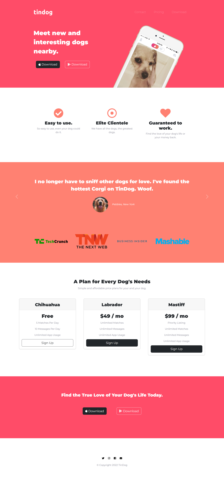
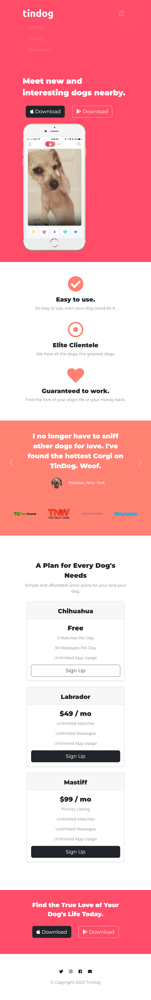

# TinDog_Webpege

This is a responsive webpege built with the use of Bootstrap 5. It represents the main page for a website that is supposed to be just like Tinder but for dogs. The layout and format are created with Bootstrap 5, which cuts down on the amount of CSS code required to write a beautiful, responsive webpage. CSS is used to complete the styling to our liking. 

 

**This webpage was developed using Bootstrap 5.2 ,HTML5, CSS.**
 

**Google fonts** 
https://fonts.google.com/about  

**Fontawesome Icons** 
https://fontawesome.com/icons 

Bootstrap 5.2 
https://getbootstrap.com/ 

Some of the Bootrsap components used for TinDog: 
**grid** 
https://getbootstrap.com/docs/5.2/layout/grid/ 
**cards** 
https://getbootstrap.com/docs/5.2/components/card/ 
**carousel** 
https://getbootstrap.com/docs/5.2/components/carousel/ 
**navbar** 
https://getbootstrap.com/docs/5.2/components/navbar/ 
**container** 
https://getbootstrap.com/docs/5.2/layout/containers/ 

Some of the CSS properties used for TinDog: 
**media query breakpoints** 
https://www.w3schools.com/css/css_rwd_mediaqueries.asp 
**transform** 
https://developer.mozilla.org/en-US/docs/Web/CSS/transform 

---

**Example views from the webpage:** 

 
 

***The home page - desktop version.*** 
 

 
 

---

 
 

***The home page - mobile version.*** 
 
